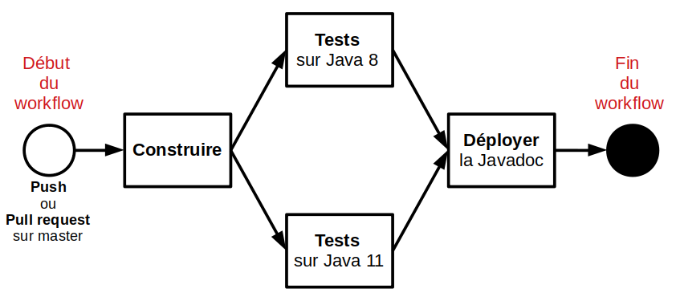

# Projet CI/CD

Ce projet est un TP visant à mettre en pratique mes connaissances théoriques et pratiques en CI/CD. L’objetif est de mettre en oeuvre la livraison continue d'un projet Java Spring Boot.

## Application

Le projet servant d'exemple est une application Spring Boot. Elle met en place un microservice pouvant servir à un commerce.

### Utilisation

En appelant l'adresse /Produits, l'application renvoie la liste des produits disponibles au format JSON.

En appelant l'adresse /Produits/{id}, avec "id" l'identifiant d'un produit, l'application renvoie ce produit au format JSON.

### Tests et documentation

Afin de pouvoir mettre en pratique l'intégration, le code a été commenté dans son intégralité. De plus, des tests couvrent toutes les fonctions de la partie DAO et de la partie métier.

## Pipeline

Pour mettre en place mon pipeline d'intégration continue, j'ai utilisé l'outil directement fourni par Github, c'est-à-dire Github Actions. En effet, après avoir testé Travic CI et Circle CI, Github Actions m'a semblé être la solution la plus simple à mettre en oeuvre. Le fichier de configuration du pipeline se trouve [ici](.github/workflows/maven.yml).

Ce pipeline est exécuté à chaque Push et Pull request effectué sur master. Il se divise en trois étapes majeures : Construire, Tests et Déployer. Ces étapes s'effectuent l'une après l'autre. Cependant, comme les étapes sont simultanées par défaut sur Github Actions, il est nécessaire d'utiliser le mot clé "needs" en précisant l'étape précédente pour obtenir ce résultat. En outre, si l'une des étapes échoue, le processus s'arrête immédiatement. S'il s'agit d'une Pull request, un message d'erreur apparaît, empéchant de poursuivre celle-ci. 



### Construire

La première étape permet de s'assurer que le projet est compilable. Pour cela, on utilise la commande maven `mvn -B compile --file pom.xml`. Si celle-ci échoue, cela signifie qu'il n'est pas possible de build le projet. Le pipeline s'arrête aussitôt et envoie un message d'erreur.

### Tests

La deuxième étape permet de s'assurer que le projet valide tous les tests. Cette étape est divisée en deux sous-étapes exécutées en parallèle. Ces dernières effectuent chacunes les tests sur une version différente de Java, l'une testant le projet sur Java 8 et l'autre sur Java 11. Pour effectue cela, on utilise l'ensemble de commandes suivantes :
```
uses: actions/setup-java@v1
      with:
        java-version: <VERSION DE JAVA>
```
Enfin, pour effectuer les tests, on utilise la commande maven `mvn -B test --file pom.xml`. Si l'une de ces sous-étapes échoue, le pipeline s'arrête.

### Déployer

La troisième étape est censé produire la documentation et le projet sous forme de site statique. Dans un premier temps, on utilise la commande maven `mvn -B javadoc:javadoc --file pom.xml`. Cette commande fonctionne parfaitement en local, mais lorsqu'elle est éxécuté dans le pipeline, elle échoue et renvoie le message d'erreur suivant :

[ERROR] Failed to execute goal org.apache.maven.plugins:maven-javadoc-plugin:3.1.1:javadoc (default-cli) on project project: An error has occurred in Javadoc report generation: Unable to find javadoc command: The javadoc executable '/usr/lib/jvm/zulu-8-azure-amd64/jre/bin/javadoc' doesn't exist or is not a file. Verify the <javadocExecutable/> parameter. -> [Help 1]

J'ai donc commenté cette partie pour que le workflow puisse arriver à son terme.

Ensuite, on exécute la commande `mvn -B clean verify --file pom.xml` pour produire le .jar du projet, déployable sur un serveur d'application.

Ensuite, on upload le .jar produit pour pouvoir le réutiliser dans une future étape grâce aux commandes suivantes : 
```
    - name: Upload Maven build artifact
      uses: actions/upload-artifact@v1
      with:
        name: artifact
        path: target/project-0.0.1-SNAPSHOT.jar
```

On pourrait par exemple mettre en place un déploiement continu en ajoutant une étape qui téléchargerait le .jar et le déploierait sur un serveur d'application.

## Tests validant le pipeline

Pour valider mon pipeline, j'ai effectué plusieurs tests en créant des pull requests avec différents scénarios. Pour cela, j'ai utilisé la branche test_pull_request.

### Pull request valide

Dans un premier temps, j'ai effectué une pull request avec une branche valide. J'ai ainsi pu vérifier que le pipeline effectuait bien toutes les étapes prévues.

### Pull request avec une branche non compilable

Dans un second temps, j'ai effectué une pull request avec une branche qui ne pouvait compiler. Comme prévu, le pipeline a stoppé à la première étape car Maven a signalé que le code n'était pas compilable.

### Pull request avec une branche ne validant pas les tests

Enfin, j'ai effectué une pull request avec une branche ne validant pas les tests. Le pipeline a passé la première étape sans problème, mais a stoppé à la seconde étape, car les test sur les deux versions de Java ont échoués (l'échec d'une seule version aurait suffit pour stopper le pipeline).


